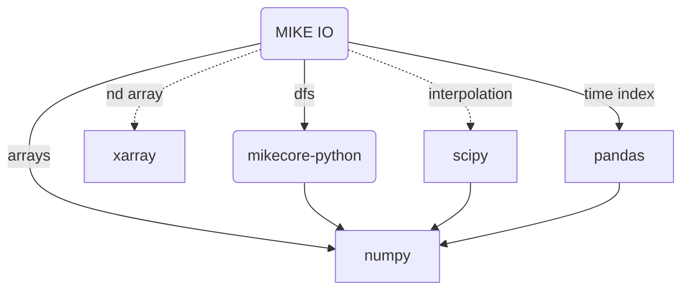

MIKE IO depends upon a number of libraries.

```mermaid
graph TD
    mikeio(MIKE IO)-->|dfs| mikecore(mikecore-python)
    mikeio--> |arrays| numpy
    mikeio -.-> |nd array| xarray
    mikecore-->numpy
    mikeio-.->|interpolation| scipy
    scipy --> numpy
    mikeio-->|time index| pandas
    pandas--> numpy
```
