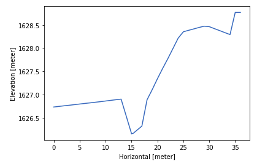
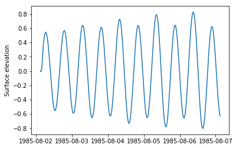

# mikeio: input/output of MIKE files in python

[https://dhi.github.io/mikeio/](https://dhi.github.io/mikeio/)

Facilitate creating, reading and writing dfs0, dfs2, dfs1 and dfs3, dfsu and mesh files. Reading Res1D data.


## Requirements
* Windows operating system
* Python x64 3.6, 3.7 or 3.8 
* [VC++ redistributables](https://support.microsoft.com/en-us/help/2977003/the-latest-supported-visual-c-downloads) (already installed if you have MIKE)

[More info about dependancies](http://docs.mikepoweredbydhi.com/nuget/)

## Installation

From PyPI: [](https://badge.fury.io/py/mikeio)


`pip install mikeio`

Or development version:

`pip install https://github.com/DHI/mikeio/archive/master.zip`


## Examples

### Reading data from dfs0, dfs1, dfs2, dfsu

Generic `read` method to read values, if you need additional features such as coordinates, use specialised classes instead e.g. `Dfsu`

```python
>>> import mikeio
>>> ds = mikeio.read("random.dfs0")
>>> ds
DataSet(data, time, items)
Number of items: 2
Shape: (1000,)
2017-01-01 00:00:00 - 2017-07-28 03:00:00

>>> ds = mikeio.read("random.dfs1")
>>> ds
DataSet(data, time, items)
Number of items: 1
Shape: (100, 3)
2012-01-01 00:00:00 - 2012-01-01 00:19:48
```

### Reading dfs0 file into Pandas DataFrame
```python
>>>  from mikeio import Dfs0
>>>  dfs = Dfs0()
>>>  ts = dfs.to_dataframe('simple.dfs0')
```

### Create simple timeseries
```python
>>>  from datetime import datetime, timedelta
>>>  import numpy as np
>>>  from mikeio import Dfs0
>>>  data = []
>>>  d = np.random.random([100])
>>>  data.append(d)
>>>  dfs = Dfs0()
>>>  dfs.create(filename='simple.dfs0',
>>>            data=data,
>>>            start_time=datetime(2017, 1, 1),
>>>            dt=60)

```
### Create timeseries from dataframe
```python
import pandas as pd
import mikeio
>>> df = pd.read_csv(
...         "tests/testdata/co2-mm-mlo.csv",
...         parse_dates=True,
...         index_col="Date",
...         na_values=-99.99,
...     )
>>> df.to_dfs0("mauna_loa.dfs0")
```

For more examples on timeseries data see this [notebook](notebooks/Dfs0%20-%20Timeseries.ipynb)


### Read dfs2 data
```python
>>>  from mikeio import Dfs2
>>> ds = dfs.read("tests/testdata/random.dfs2")
>>> ds
DataSet(data, time, items)
Number of items: 1
Shape: (3, 100, 2)
2012-01-01 00:00:00 - 2012-01-01 00:00:24
>>> ds.items
[testing water level <Water Level> (meter)]
```

### Create dfs2
For a complete example of conversion from netcdf to dfs2 see this [notebook](notebooks/Dfs2%20-%20Sea%20surface%20temperature.ipynb).

Another [example](notebooks/Dfs2%20-%20Global%20Forecasting%20System.ipynb) of downloading meteorlogical forecast from the Global Forecasting System and converting it to a dfs2 ready to be used by a MIKE 21 model.


### Read Res1D file Return Pandas DataFrame
```python
>>>  from mikeio import res1d
>>>  # Query the discharge time series at chainage 10.1 of branch1
>>>  q1 = res1d.QueryData('Discharge', 'branch1', 10.1)
>>>  # Query all the discharge time series of branch2
>>>  q2 = res1d.QueryData('Discharge', 'branch2')
>>>  # Query all the water level time series in the file
>>>  q3 = res1d.QueryData('WaterLevel')
>>>  # Combine the queries in a list
>>>  queries = [q1, q2, q3]
>>>  # The returned ts object is a pandas DataFrame
>>>  ts = res1d.read('res1dfile.res1d', queries)
```

### Read Xns11 file Return Pandas DataFrame
```python
>>>  import matplotlib.pyplot as plt
>>>  from mikeio import xns11
>>>  # Query the geometry of chainage 58.68 of topoid1 at reach1
>>>  q1 = xns11.QueryData('topoid1', 'reach1', 58.68)
>>>  # Query the geometry of all chainages of topoid1 at reach2
>>>  q2 = xns11.QueryData('topoid1', 'reach2')
>>>  # Query the geometry of all chainages of topoid2
>>>  q3 = xns11.QueryData('topoid2')
>>>  # Combine the queries in a list
>>>  queries = [q1, q2, q3]
>>>  # The returned geometry object is a pandas DataFrame
>>>  geometry = xns11.read('xsections.xns11', queries)
>>>  # Plot geometry of chainage 58.68 of topoid1 at reach1
>>>  plt.plot(geometry['x topoid1 reach1 58.68'],geometry['z topoid1 reach1 58.68'])
>>>  plt.xlabel('Horizontal [meter]')
>>>  plt.ylabel('Elevation [meter]')
```


### Read dfsu files
```python
>>>  import matplotlib.pyplot as plt
>>>  from mikeio import Dfsu
>>>  dfs = Dfsu()
>>>  filename = "HD.dfsu"
>>>  res = dfs.read(filename)
>>>  idx = dfs.find_closest_element_index(x=608000, y=6907000)
>>>  plt.plot(res.time, res.data[0][:,idx])
```


## Items, units
 Useful when creating a new dfs file
```python
>>> from mikeio.eum import EUMType, EUMUnit
>>> EUMType.Temperature
<EUMType.Temperature: 100006>
>>> EUMType.Temperature.units
[degree Celsius, degree Fahrenheit, degree Kelvin]
>>> EUMUnit.degree_Kelvin
degree Kelvin
```
