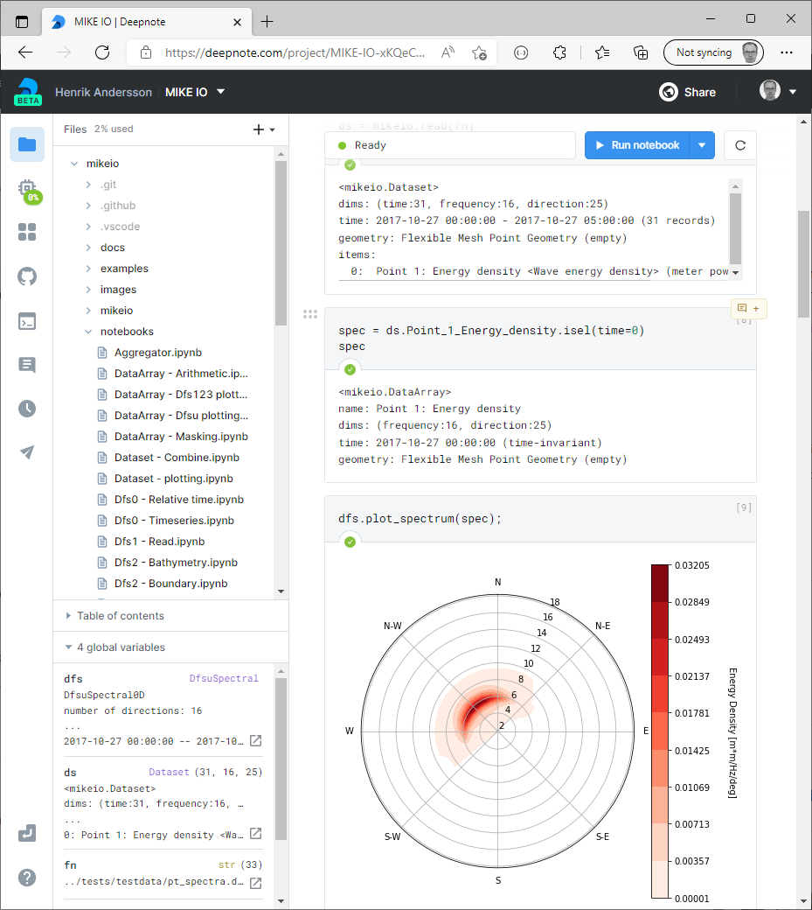
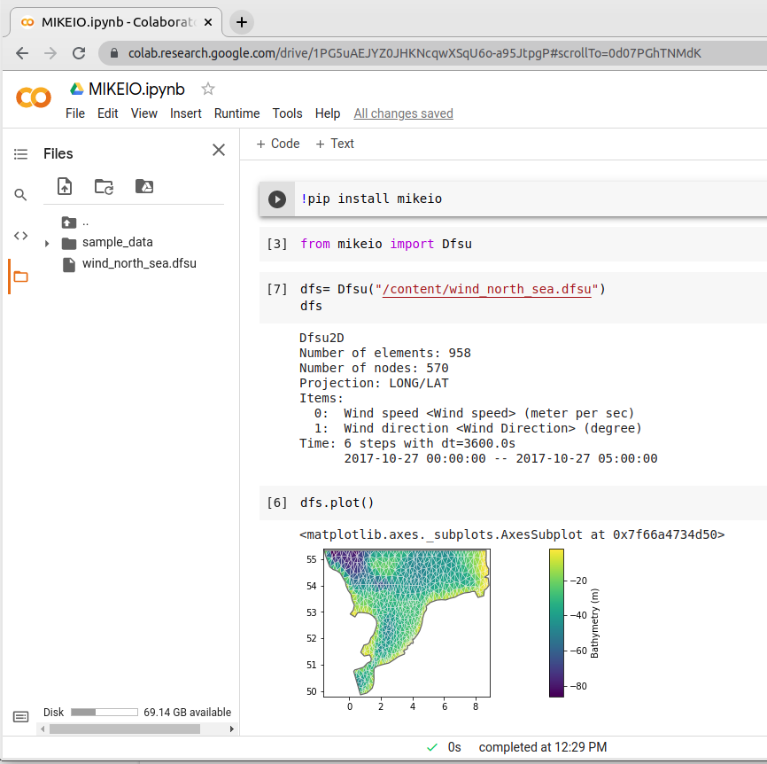

# MIKE IO: input/output of MIKE files in Python
 
 [](https://github.com/DHI/mikeio/actions/workflows/full_test.yml)
[](https://badge.fury.io/py/mikeio)


Read, write and manipulate dfs0, dfs1, dfs2, dfs3, dfsu and mesh files.

MIKE IO facilitates common data processing workflows for [MIKE files in Python](https://www.mikepoweredbydhi.com/products/mike-for-developers#io).

[](http://www.youtube.com/watch?v=Jm0iAeK8QW0)

[](http://www.youtube.com/watch?v=0oVedpx9zAQ)

## Requirements
* Windows or Linux operating system
* Python x64 3.8 - 3.11
* (Windows) [VC++ redistributables](https://support.microsoft.com/en-us/help/2977003/the-latest-supported-visual-c-downloads) (already installed if you have MIKE)

[More info about dependencies](http://docs.mikepoweredbydhi.com/nuget/)

## Where can I get help?
* Documentation - [https://dhi.github.io/mikeio/](https://dhi.github.io/mikeio/)
* General help, new ideas and feature requests - [GitHub Discussions](http://github.com/DHI/mikeio/discussions) 
* Bugs - [GitHub Issues](http://github.com/DHI/mikeio/issues) 

## Installation

From PyPI: 

`pip install mikeio`

Or development version:

`pip install https://github.com/DHI/mikeio/archive/main.zip`

:warning: **Don't use conda to install MIKE IO!**, the version on conda is outdated.

## Tested

MIKE IO is tested extensively.

See detailed test coverage report below:
```
---------- coverage: platform linux, python 3.11.1-final-0 -----------
Name                              Stmts   Miss  Cover
-----------------------------------------------------
mikeio/__init__.py                   38      2    95%
mikeio/base.py                       26      5    81%
mikeio/data_utils.py                111      5    95%
mikeio/dataarray.py                 992    152    85%
mikeio/dataset.py                   772    100    87%
mikeio/dfs0.py                      299     24    92%
mikeio/dfs1.py                       67      3    96%
mikeio/dfs2.py                      188      8    96%
mikeio/dfs3.py                      186     26    86%
mikeio/dfs.py                       288     36    88%
mikeio/dfsu/__init__.py               3      0   100%
mikeio/dfsu/dfsu.py                 592     56    91%
mikeio/dfsu/factory.py               41      2    95%
mikeio/dfsu/layered.py              180     20    89%
mikeio/dfsu/spectral.py             127      6    95%
mikeio/dfsutil.py                   129     15    88%
mikeio/eum.py                      1324     12    99%
mikeio/exceptions.py                 25      8    68%
mikeio/generic.py                   433     16    96%
mikeio/interpolation.py              60      5    92%
mikeio/pfs/__init__.py                4      0   100%
mikeio/pfs/pfsdocument.py           242     16    93%
mikeio/pfs/pfssection.py            220      9    96%
mikeio/spatial/FM_geometry.py      1118    102    91%
mikeio/spatial/FM_utils.py          293     30    90%
mikeio/spatial/__init__.py            0      0   100%
mikeio/spatial/crs.py                50      4    92%
mikeio/spatial/geometry.py           90     33    63%
mikeio/spatial/grid_geometry.py     558     42    92%
mikeio/spatial/utils.py              38      0   100%
mikeio/spectral.py                   90      5    94%
mikeio/track.py                     100     14    86%
mikeio/xyz.py                        12      0   100%
-----------------------------------------------------
TOTAL                              8696    756    91%

=========== 697 passed, 3 warnings in 46.01s ========
```

## Cloud enabled

It is possible to run MIKE IO in your favorite cloud notebook environment e.g. [Deepnote](https://deepnote.com/), [Google Colab](https://colab.research.google.com/), etc...






