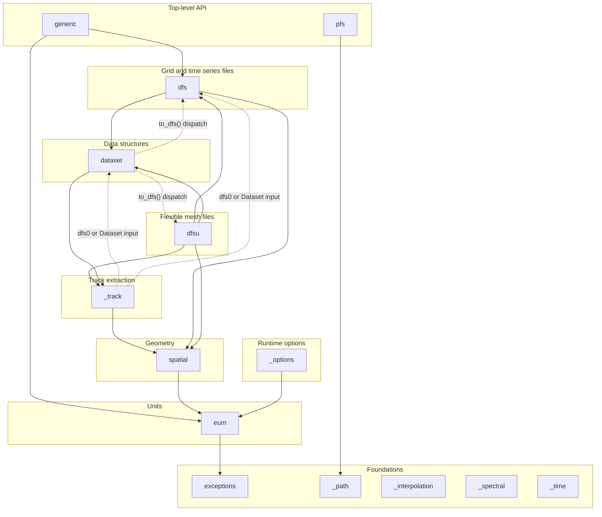

# ADR-011: Enforced Import Layering

**Status:** Accepted
**Date:** 2026-09

## Context

MIKE IO's modules have an order to them — `eum` knows nothing about `dfsu`, and `dfsu` builds on `dfs` and `dataset` — but nothing recorded or checked it. A module could import any other, and the only way to find out whether the structure still held was to read the imports.

It had already started to give. Five modules read `__dfs_version__` from the root package (`from .. import __dfs_version__`) rather than from a module that defines it. Since `mikeio/__init__.py` imports the whole package, each of those is an edge to everything: `dfsu` reached `pfs`, `dfs` reached `dfsu`, all through `__init__`. Three more places did the same for `Dataset` (`from mikeio import Dataset`) and `__version__` (`from mikeio import __version__`), hiding that the real dependency was on `dataset` or nothing at all.

Two dependencies point genuinely the other way, and are load-bearing rather than accidental: `Dataset.to_dfs()` dispatches on the output file's suffix, so it has to reach down into the writer of every format, including `dfsu`, which sits above `dataset` in the ordering; and track extraction accepts either a dfs0 file or a `Dataset` as its input, and returns a `Dataset` as its result. Both are deferred into the function body that needs them, which keeps the module itself importable but is invisible from the top of the file.

## Decision

Write the layering down in `.importlinter` and check it with [import-linter](https://import-linter.readthedocs.io/) on every build (`just layers`, part of `just check`).

Modules may import downward and never upward. Modules sharing a layer may import each other (`generic` and `pfs` do).

Each box is a layer, named for what it contributes; modules inside a layer may import each other. Arrows point from importer to imported, and transitively implied edges are omitted. The two dotted pairs are the accepted violations.

## Alternatives Considered

**Leave it to review** — the eight root-package imports all passed review; a reviewer sees one import, not what it does to the graph.

**Independence contracts instead of layers** — these forbid modules importing each other without saying which direction is correct. Layers state the intended shape, so a new module has somewhere to belong.

**Fix `to_dfs()` and track extraction to remove the upward imports** — both would need a registry of writers/readers keyed by suffix, decoupling `dataset` from the concrete file-format modules. That is a real option for the future, but a larger change than this ADR is about; recording the two dependencies as accepted exceptions makes them visible now without forcing that redesign.

## Consequences

- A new module has to be placed in a layer, which is the question worth asking when adding one.
- Type-only imports are excluded (`exclude_type_checking_imports`), so an annotation may point upward.
- The ignore list is the debt list. It is seven lines, expanding two conceptual exceptions across the files each touches; if it grows beyond that it's a sign the layering, or the code, needs to change.
- `from .. import X` / `from mikeio import X` across a layer boundary is now a violation — it names the re-export rather than the module that defines it.
- import-linter is a test-group dependency, next to mypy, since that is what CI installs.
