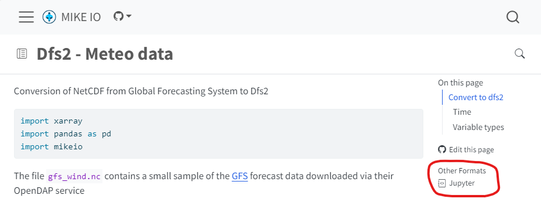

The notebooks in this folder are considered legacy and are being replaced by the documentation available at <https://dhi.github.io/mikeio>.

The contents are moving to either the [user guide](https://dhi.github.io/mikeio/user-guide/getting-started.html) or the [examples](https://dhi.github.io/mikeio/examples/) section of the documentation.

On each page in the documentation, there is a link to download as a Jupyter notebook. 

If you find a notebook here that you would like to see in the documentation, please let us know by creating an issue in the [issue tracker](https://github.com/DHI/mikeio/issues). 

